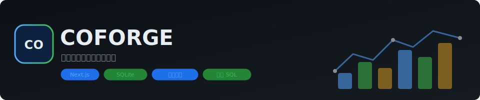

# COFORGE

<p align="center">
  
</p>

**COFORGE 是一个煤炭运营智能分析工作台。** 它面向煤炭采购、航运、库存、合同和配煤等经营场景，让使用者用自然语言提出问题；系统调用用户自行配置的模型服务生成只读 SQL，在本地 SQLite 数据库上执行查询，并返回图表、查询依据和经营分析建议。

macOS 桌面版已把 MIT 许可的 Reasonix Go runtime 作为内置 Agent 内核，通过 ACP stdio 驱动第一方 COFORGE MCP 工具；用户不需要单独安装或操作 Reasonix。默认模型服务为 DeepSeek 官方 API，模型 ID 为 `deepseek-v4-pro`，并使用 `max` 推理强度。这里的 `max` 是 reasoning effort，而不是另一个模型 ID；其它兼容服务保留为高级选项。

本仓库为公开演示安全版本，采用 Apache-2.0 许可，仅包含合成样例数据。仓库不包含公司真实数据、真实船期、真实价格表、交易对手信息、私有配煤逻辑、API key，也不复制任何私有 CO 系列仓库代码。

## 项目定位

煤炭运营判断通常横跨船期、装卸港、煤质、海运费、库存、合同、价格指数和配煤约束。直接询问通用大模型可以获得概念解释，但它默认不知道本地数据结构，也不能自动执行查询、保留 SQL 证据链或限制数据库写权限。

COFORGE 的重点是把模型放进一个可控的业务分析框架：

- 只向模型暴露受控的数据表结构；
- 要求模型生成单条 SQLite `SELECT` 查询；
- 执行前校验 SQL AST，阻断写入、删除、更新等非只读操作；
- 在本地只读数据库上执行查询；
- 用查询结果反向约束最终分析，避免脱离数据空谈；
- 模型 endpoint 与预算配置保存在本机；桌面 API key 使用系统凭据库，不进入 `settings.json`。

当前版本是公开演示和产品方向验证，不代表已经接入真实业务系统。真实业务落地前仍需完成数据口径、权限边界、安全合规、凭证管理和流程嵌入等工作。

## 演示范围

合成样例数据库覆盖以下对象：

- 48 条煤炭船货记录；
- 5 家样例供应商；
- 5 类煤质规格；
- 9 个装卸港；
- 18 个月价格指数样例；
- 航线与月度运价样例；
- 库存头寸；
- 配煤方案；
- 合同样例。

可尝试的问题：

- 哪些在途船最需要关注？
- 印尼 4200 和澳煤 5500 的到岸成本怎么比？
- 库存还能覆盖多少天？
- 哪个配煤方案成本最低且硫灰可控？

工作台右侧还提供合成输入的业务计算实验台，当前可直接运行：

- 投标 Incoterm/到厂成本、热值归一、敏感性、运费平衡点、盈亏预警和船型 Beta；
- 采购煤质匹配、内外贸单位热值成本、库存头寸和供应商评分；
- 确定性航次成本、TCE 与 VLSFO 情景；
- Laytime/SOF Strict 与 Concession 双口径及对方 claim 差异核对；
- 质量与库存硬约束下的离散配煤优化；
- 交付窗口、港口、数量资格过滤后的逐延误船替代排名；
- 多期库存守恒、采购、持有、缺货和期末库存约束下的滚动成本优化。

上述计算返回 `method`、`version`、`assumptions` 和单位口径。首页五个摘要卡仍明确标记为合成数据演示摘要；摘要中的启发式/预计算筛选不冒充生产预测或优化结果。

## 架构

1. **本地数据层**：SQLite 在本地运行，公开演示数据库以只读方式打开。
2. **模型分析框架**：外部模型负责理解问题、生成 SQL 和解释结果，不直接拥有数据库写权限。
3. **SQL 约束**：使用 `node-sql-parser` 校验语句必须是单条 `SELECT`，按业务表白名单阻断系统表、危险函数和通配查询，并限制实际顶层 `LIMIT`。
4. **查询与溯源**：查询在隔离子进程中执行，带硬超时、并发队列、行/列/单元格/响应字节上限；结果 envelope、UI 和最终解释使用同一条实际执行 SQL，并追加只含哈希和元数据的脱敏审计事件。
5. **BYOK 配置**：用户在本地应用中配置自己的模型 endpoint 与 key/token。公开托管演示不应收集用户 API key。

## 模块设想

公开版本把原 CO 系列方向合并为演示安全模块，用于说明未来可能的业务工具边界：

### COVISTA - Coal Vessel Intelligence & Status Analytics

COVISTA 面向煤炭进口散货船排期与船队监控，目标是把装港、在途、抵港待卸、卸港作业和远期排布放在同一个状态视图中。旧工具设计为卡片式实时看板，支持四象限船货状态、总船数/直销/自用/高优先级预警 KPI、船卡时间线、ETA/ETB/ETC、港口备注和关键 ETA 日期高亮。

在 COFORGE 中，COVISTA 对应船货状态、ETA、滞期和到岸成本关注清单。公开演示版使用合成船货数据，展示延误船货、在途风险、预计到港和到岸成本排序；生产版本可扩展接入 EDI/API feeds、内部船期表或 Excel 导出流程。

### COFARE - Coal Freight Analytics & Rate Engine

COFARE 面向煤炭航次租船运价估算，用于分析印尼 East Kalimantan、South Kalimantan、South Sumatra 以及澳大利亚 Newcastle 到华南港口的 voyage charter freight rates。旧工具目标是用历史运价、航线因子、市场指数、季节变量和燃油价格建立透明、可更新的运价预测框架，作为船东报价和商业运价系统之外的低成本参考。

在 COFORGE 中，COFARE 对应航线运价、船型、燃油和拥堵风险对比。公开演示版使用合成 freight quotes 展示不同航线、船型、bunker 成本和拥堵天数下的风险调整运价。旧 COFARE 仓库中的 VLSFO HTML 看板、Brent/VLSFO spread 脚本、多港卸货 laytime/demurrage 示例、数据清洗回测、变量筛选和 Optuna + LightGBM 调参脚本只保存在私有 archive。

### CORICE - Coal Rolling Index Cost Engine

CORICE 面向进口煤采购中的滚动库存和成本决策，核心是围绕 ICI、API、M42 等指数观察合同、库存和采购成本变化。旧工具设想使用 PuLP-based rolling horizon models，在多周期质量、可用量、仓储和采购约束下最小化采购成本与库存持有成本。

在 COFORGE 中，CORICE 对应合同价格与指数口径的滚动成本观察。公开演示版展示固定合同价相对指数价格的差异、未结货量、平均合同价和不同煤种指数口径；生产版本可进一步连接真实合同、库存、指数报价和采购计划。

### COBLOP - Coal Blending Linear Optimization Program

COBLOP 面向煤炭交易、采购团队和电厂配煤决策，用于寻找满足热值、灰分、硫分等电厂煤质约束的最低成本配煤方案。旧工具设想包括单批次和多周期 PuLP 配煤优化、库存 carry-over、船货到港排期约束、船期延误与质量波动 Monte Carlo simulation，以及 Sobol indices 和 Partial Dependence Plots 等敏感性分析。

在 COFORGE 中，COBLOP 对应质量约束下的配煤方案筛选。公开演示版使用合成配煤方案表，比较目标热值、硫分、灰分和 blended cost，帮助快速识别质量达标且成本较低的组合；真实落地时应把私有配煤约束、煤质化验、库存和电厂燃烧要求留在私有适配器中。

### COSWAP - Coal Swap Optimizer

COSWAP 面向“先中标、后找船”场景下的船货替代决策。当已订船舶延误或无法满足交付窗口时，旧工具用于快速评估可替代船货，计算换船后的成本差异、热值/灰分/硫分偏离、风险等级、潜在罚则，并输出 Recommended / Caution / Not Recommended 等执行建议。

在 COFORGE 中，COSWAP 对应延误船货替代与换船风险评分。公开演示版用合成船货表比较 delayed vessel 与候选船货之间的成本 delta、煤质偏差和 swap risk score；生产版本可与 COVISTA 船期、COFARE 运价、CORICE 合同成本和 COBLOP 配煤结果联动。

### 工具闭环

五个方向在业务上形成一个煤炭运营决策闭环：COVISTA 提供船货状态和物流态势，COFARE 估算航线运费和燃油影响，CORICE 观察指数、合同和滚动采购成本，COBLOP 在质量约束下筛选低成本配煤方案，COSWAP 在船货延误或交付窗口变化时做替代评估。

这些模块当前使用合成数据和公开演示逻辑，仅用于产品方向验证。旧工具 README 中经复核的公开产品语义已整理到 `docs/CO-SERIES-TOOLS.md`；旧仓库文件与完整 Git 历史只保留在私有归档，不进入新的公开仓库。公开迁移边界详见 `docs/CO-SERIES-MIGRATION.md`。

## 仓库边界

本仓库按公开发布标准处理：

- 不提交真实公司数据；
- 不提交真实船期、真实报价、真实合同或交易对手信息；
- 不提交 API key、模型 token、`.env.local` 或本机路径；
- `data/coal-demo.db` 由 `scripts/seed-coal-demo.js` 生成；
- 旧 CO 系列文件与完整 Git 历史只留在公开仓库之外的私有归档；新的公开 Git 树不含 `legacy/co-series/`。

未来如需连接真实业务系统，应通过私有适配器完成，并确保凭证、生产数据和权限策略留在仓库外。

## 快速开始

```bash
git clone https://github.com/eric-stone-plus/COFORGE.git
cd COFORGE
npm install
node scripts/seed-coal-demo.js
npm run dev
```

打开 `http://localhost:3000`。

完整验证：

```bash
npm run verify
npm run sbom
npm run verify:sbom
docker build -t coforge:local .
```

本机容器默认只发布到 loopback，并使用 Docker named volume 保存 token ledger 与脱敏审计：

```bash
docker volume create coforge-config
docker run --detach --name coforge \
  --read-only \
  --tmpfs /tmp:rw,noexec,nosuid,nodev,size=16m \
  --mount type=volume,src=coforge-config,dst=/var/lib/coforge \
  --publish 127.0.0.1:3000:3000 \
  coforge:local
```

`/api/live` 是不访问数据库、磁盘、角色或限流状态的进程 liveness；desktop 模式只校验进程级 capability，
hosted/container 模式不依赖鉴权配置。`/api/health` 是访问合成数据库和公开配置的
HTTP readiness。镜像内置的 Docker healthcheck 不走共享 HTTP 限流桶，而是从容器内检查 `/api/live`、
只读数据库和配置卷写权限，避免外部请求耗尽 readiness 限流后误报容器故障。正式部署仍应分别配置平台的
liveness/readiness，并保持 `/var/lib/coforge` 可写。

若使用宿主机 bind mount，目录必须归 UID/GID `10001` 所有；仅创建一个 root 所有的 `0755` 目录会使
token ledger、审计和健康检查失败：

```bash
sudo install -d -m 0700 -o 10001 -g 10001 /srv/coforge/config
docker run --detach --name coforge \
  --read-only --tmpfs /tmp:rw,noexec,nosuid,nodev,size=16m \
  --mount type=bind,src=/srv/coforge/config,dst=/var/lib/coforge \
  --publish 127.0.0.1:3000:3000 \
  coforge:local
```

Kubernetes 的 Pod/container `securityContext` 至少应使用 `runAsNonRoot: true`、`runAsUser: 10001`、
`runAsGroup: 10001`、`fsGroup: 10001` 和 `readOnlyRootFilesystem: true`，并把 PVC 或 `emptyDir` 挂到
`/var/lib/coforge`、把内存 `emptyDir` 挂到 `/tmp`。若 CSI 驱动不应用 `fsGroup`，需由存储供应或受控的
init container 预先把卷设为 `10001:10001`；不要为解决权限问题改成 root 运行。

`npm run sbom` 使用 `package-lock.json` 中精确固定的 `@cyclonedx/cyclonedx-npm` 生成
CycloneDX 1.6 JSON，仅列出生产依赖，输出到 `artifacts/sbom/coforge.cdx.json`。生成采用
reproducible 模式并立即验证根组件、Apache-2.0 声明、依赖图引用和本机路径泄露；CI 会把同一文件
作为 `coforge-cyclonedx-sbom` artifact 保留 30 天，不使用临时 `npx` 或运行时下载。

容器镜像在 `/app/licenses/` 中携带 COFORGE `LICENSE` 与 `NOTICE`。构建还会以实际 Next standalone
运行时依赖树为准，在 `/app/licenses/third-party/` 生成逐组件许可证/notice 文本、SPDX license expression、
组件版本和文件 SHA-256；缺少许可证文本、组件对应关系不唯一、文件不在 manifest 或 hash 不符都会使构建
失败。CycloneDX JSON 是 npm 应用依赖清单，不等同于容器基础镜像的完整系统包 SBOM；正式镜像发布仍应由
registry/build pipeline 对最终 image digest 生成并附加 OS 包许可证、镜像级 SBOM/attestation。

配置 DeepSeek key 后，可用一条最小真实请求验证官方端点、`deepseek-v4-pro` 与 `reasoning_effort=max`：

```bash
DEEPSEEK_API_KEY='your-key' npm run smoke:deepseek
```

脚本只从当前进程环境读取 key，不写文件、不回显 key。没有 key 时它会直接失败；这与无需凭证即可得到的 HTTP 401 网络可达性检查不同。

托管演示默认允许匿名分析员访问合成数据接口，同时对高成本 POST 路径限流；不要把未配置的镜像直接用
`--publish 3000:3000` 暴露到公网。设置、模型连接测试和 token 计划写入要求 `COFORGE_ADMIN_TOKEN`。
若关闭匿名演示（`COFORGE_DEMO_ANONYMOUS=0`），分析接口还需 `COFORGE_ANALYST_TOKEN`。部署时应设置
`COFORGE_ALLOWED_ORIGINS`，所有 token 都只通过部署平台 Secret 注入，不能写入镜像、命令行或仓库。
只有受控反向代理会清洗并重写转发头时才能设置 `COFORGE_TRUST_PROXY=1`；默认忽略客户端提供的
`X-Forwarded-*`。容器可用只读根文件系统运行，但需给 `/var/lib/coforge` 挂载可写卷。

公开仓库发布前会运行边界检查，默认阻止内部工作资料、Office/压缩归档、Git bundle、生产数据库、环境文件和凭证进入公开 Git 树。生成最终公开候选时使用 `COFORGE_PUBLIC_RELEASE=1 npm run check:public`，它还会强制拒绝 `legacy/co-series/`。GitHub 公开仓仅备份源码与合成数据；真实业务资料和完整历史必须进入私有、加密且访问受控的备份。

## 桌面端构建

当前桌面包装会生成一个 macOS 应用，内置本地 Next 服务、Node 运行时、合成 SQLite 数据库、
第一方 COFORGE MCP 工具桥，以及当前 host 架构的固定版本 Reasonix beta。

```bash
node scripts/seed-coal-demo.js
./desktop/build_macos.sh
open desktop/dist/COFORGE.app
```

构建要求先把 release manifest 对应的已校验 Reasonix binary 和上游 `LICENSE` 放入
`desktop/.runtime/reasonix-v1.17.11-darwin-<arch>/`；也可用绝对路径
`REASONIX_BINARY`、`REASONIX_LICENSE` 显式指定。构建只读取本地文件并校验 SHA，应用运行时不会下载。
生成的应用在 `Contents/Resources/licenses/` 中同时携带 COFORGE Apache `LICENSE`/`NOTICE`、Node.js
许可证、Reasonix MIT 许可证，以及与 standalone Node 运行时逐组件对账、带 SHA-256 清单的 npm 第三方
许可证文本；缺失组件、文本、清单外文件或哈希异常都会使构建失败。
脚本固定并校验 Node.js 与 Reasonix 下载物的 SHA-256。默认生成仅供本机开发验证的 ad-hoc 签名包；
为了让 ad-hoc Node 在本机加载开发环境构建的 native addons，该模式会显式加入
`com.apple.security.cs.disable-library-validation`；这只是开发例外，不是可信签名边界，也不能进入发行包。
ad-hoc 包不通过 Gatekeeper，不能作为正式分发包。正式发布必须设置
完整 Developer ID identity、匹配的 10 位 Team ID 和 Keychain 中的 notarytool profile：

```bash
xcrun notarytool store-credentials COFORGE-notary \
  --apple-id 'release@example.com' --team-id 'TEAMID1234'

COFORGE_SIGNING_IDENTITY='Developer ID Application: Company Name (TEAMID1234)' \
COFORGE_TEAM_ID='TEAMID1234' \
COFORGE_REQUIRE_DISTRIBUTION_SIGNATURE=1 \
COFORGE_NOTARY_PROFILE='COFORGE-notary' \
COFORGE_NOTARIZE=1 \
./desktop/build_macos.sh
```

Developer ID 构建会要求可信时间戳、hardened runtime，保持 library validation 开启，逐个使用同一
Developer ID 团队签名 Node、Reasonix 与所有 native addon，再校验 identifier、Team ID 和嵌套签名；
任何发行 entitlement 出现 `disable-library-validation` 都会 fail closed。`COFORGE_NOTARIZE=1` 会提交、
等待 Apple 接受、staple、验证 ticket 与 Gatekeeper，再重建最终 zip；也可在签名构建后单独运行
`COFORGE_TEAM_ID=... COFORGE_NOTARY_PROFILE=... ./desktop/notarize_macos.sh`。
本机没有 Developer ID identity 或 notary profile 时正式模式会直接失败；不得把 ad-hoc 开发包改名后分发。
macOS 桌面应用默认启用该 Reasonix beta；只有显式以
`COFORGE_REASONIX_ENABLED=0 open desktop/dist/COFORGE.app` 启动时才回退到原有 agent 路径。当前 ACP v1
不返回可靠 token usage，因此 beta 会在调用前 fail closed 检查预算容量，并在结果明确标记
`usageUnavailable: true`；不能把这些 turn 声称为已完成精确 token 入账。

打开应用后，在右上角“设置”中选择模型服务并填写自己的 key/token。默认由每位使用者自行注册 DeepSeek 账户、充值并创建 API key；费用与可用退款由 DeepSeek 按其账户政策处理，COFORGE 不代收款。内置 Reasonix 只接收 OpenAI-compatible backend、官方 `api.deepseek.com` HTTPS 主机（默认 443、无凭据/query/fragment、仅根路径或 `/v1`）与精确模型 ID `deepseek-v4-pro` 的组合；选择其它兼容接口或 Anthropic 时会使用原有受控 agent 路径，绝不会把其它服务的 key 交给 DeepSeek。

非敏感本地配置写入用户应用支持目录；API key 不进入 `settings.json`，macOS helper 把 key 存入仅限本机、解锁时可用的 Keychain 项。升级时如果旧版 `settings.json` 含有明文 key，应用会先原子重写配置以删除明文字段，再尝试写入 Keychain；Keychain 不可用或迁移失败时会明确报错、停止使用该 key，并要求用户在安全存储恢复后重新输入，不会把明文重新写回文件。helper 只接受同一包内 Node 子进程调用，并通过标准输入接收 key，命令行参数和服务日志都不包含密钥。只有 Developer ID 签名、公证且校验 designated requirement/team 的正式构建才能把这一点称为可信签名边界；当前 ad-hoc 开发包仅用于本机验证。

当前没有可发布的 Windows 桌面包；Windows Credential Manager helper 也尚未实现。运行时代码只预留相同的版本化 helper 协议入口，未来需由受信的 Windows 桌面打包器实现，并注入绝对路径 `COFORGE_CREDENTIAL_HELPER` 及 `COFORGE_CREDENTIAL_HELPER_SHA256` 固定值。缺少 helper、hash pin 不匹配或协议失败都会 fail closed：设置 API 返回稳定错误，界面禁用密钥保存，也不会明文持久化。这一 fail-closed 边界不代表 Windows 已受支持。macOS 桌面包装仍会为每次启动生成随机 capability，并把服务限制在 loopback Host、同源请求和 JSON 写入边界；本地/LAN 模型地址仍需显式设置 `COFORGE_ALLOW_PRIVATE_PROVIDER=1`。

## 模型与合规说明

COFORGE 不转售模型能力、不代收模型费用，也不内置公共 API key。它是 BYOK（Bring Your Own Key）分析工作台，使用者需要自行确认所选模型服务的充值、退款和数据条款，并确认有权把待分析数据提交给相应模型服务。

公开演示请只使用合成数据。真实运营场景应先完成内部数据治理、安全合规和模型供应商评估，再接入生产数据。

## 许可证

COFORGE 采用 Apache License 2.0。内置或随安装包分发的 Reasonix 保留其 MIT 许可证与归属，Node.js 保留其上游许可证；详见 `NOTICE` 和桌面应用的 `Contents/Resources/licenses/`。项目贡献者见 `CONTRIBUTORS.md`。
